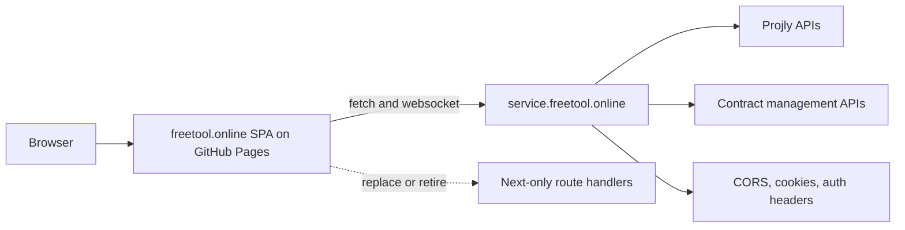

# GitHub Pages Migration Plan

## Scope

- Move the frontend repo to a static SPA that GitHub Pages can host.
- Keep the backend repo deployed separately and make it accept requests from the Pages origin.
- Update the deployment guide so it matches the real repo setup instead of a generic example.

## Latest Stage Update

- The frontend SPA migration is in place: Vite entrypoints, `HashRouter`, Next compatibility shims, runtime env mapping, and browser-safe code-editor handling are implemented.
- The frontend no longer depends on local Next route handlers for filesystem actions; those `app/api/**` routes were removed from the frontend repo.
- The backend now accepts GitHub Pages and local Vite dev origins through shared CORS/origin matching across HTTP, auth, and websocket paths.
- The GitHub Pages workflow and repo-specific deployment guide have been added.
- Remaining work is production-like validation on a machine with the frontend dependencies installed; the last local build attempt failed because `vite` was not installed in this environment yet.

## Key Files

- Frontend shell and build: `[freetool.online/package.json](D:/Documents/Code/freetool/freetool.online/package.json)`, `[freetool.online/next.config.mjs](D:/Documents/Code/freetool/freetool.online/next.config.mjs)`, `[freetool.online/app/layout.tsx](D:/Documents/Code/freetool/freetool.online/app/layout.tsx)`, `[freetool.online/middleware.ts](D:/Documents/Code/freetool/freetool.online/middleware.ts)`
- Frontend API surface and server-only routes: `[freetool.online/lib/api-client.ts](D:/Documents/Code/freetool/freetool.online/lib/api-client.ts)`, `[freetool.online/app/projly/config/apiConfig.ts](D:/Documents/Code/freetool/freetool.online/app/projly/config/apiConfig.ts)`, `[freetool.online/app/api/filesystem/route.ts](D:/Documents/Code/freetool/freetool.online/app/api/filesystem/route.ts)`, `[freetool.online/app/code-editor/store/vs-code-store.ts](D:/Documents/Code/freetool/freetool.online/app/code-editor/store/vs-code-store.ts)`
- Backend readiness and CORS: `[service.freetool.online/package.json](D:/Documents/Code/freetool/service.freetool.online/package.json)`, `[service.freetool.online/server.js](D:/Documents/Code/freetool/service.freetool.online/server.js)`, `[service.freetool.online/config/settings.json](D:/Documents/Code/freetool/service.freetool.online/config/settings.json)`, `[service.freetool.online/middleware.ts](D:/Documents/Code/freetool/service.freetool.online/middleware.ts)`, `[service.freetool.online/app/api/cors-config/route.ts](D:/Documents/Code/freetool/service.freetool.online/app/api/cors-config/route.ts)`, `[service.freetool.online/app/api/cors-auth/route.ts](D:/Documents/Code/freetool/service.freetool.online/app/api/cors-auth/route.ts)`, `[service.freetool.online/lib/websocket/websocket-server.ts](D:/Documents/Code/freetool/service.freetool.online/lib/websocket/websocket-server.ts)`
- Deployment guide: `[DEPLOY_TO_GITHUB_PAGES.md](D:/Documents/Code/freetool/freetool.online/DEPLOY_TO_GITHUB_PAGES.md)`

## Frontend Workstream

1. Freeze the Pages-compatible feature set and decide how to handle the filesystem-backed code editor flow that currently depends on `app/api/filesystem/**`.
2. Rebuild `freetool.online` as a Vite/React SPA with `HashRouter` as the safe default, port the shell and metadata from `app/layout.tsx`, and replace Next-only primitives, host-based production checks, and middleware behavior.
3. Point every runtime API call at `https://service.freetool.online` through one shared client path and remove any local `/api/*` assumptions from the static build.

## Backend Workstream

1. Update `service.freetool.online` so the GitHub Pages origin is included in CORS/auth allowlists, then verify credentialed requests, bearer auth, and Socket.IO/WebSocket traffic from that origin.
2. Keep `server.js`, `config/settings.json`, and middleware/websocket config in sync so the production server path continues to match the frontend’s new cross-origin requests.

## Deployment and Docs

1. Add the GitHub Pages workflow for the frontend, set the Vite base path for the repo URL, and rewrite `DEPLOY_TO_GITHUB_PAGES.md` so it matches the actual build and deploy flow for this repo.
2. Validate both projects together against production-like conditions, including deep links, FFmpeg/WASM or other header-sensitive tools, auth, and cross-origin API calls, then remove any remaining Next-only leftovers once the SPA build is stable.

