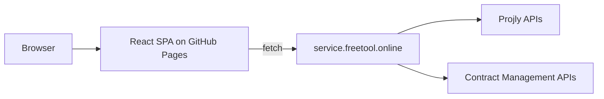

# React SPA Migration for GitHub Pages

Move this repo from Next.js to a frontend-only Vite + React app that builds to `dist` and deploys through GitHub Pages, following the guidance in [DEPLOY_TO_GITHUB_PAGES.md](D:/Documents/Code/freetool.online/DEPLOY_TO_GITHUB_PAGES.md). The backend stays external and separately deployed at `service.freetool.online`; this repo will only consume its APIs.

## Scope

- Keep the existing UI and product surface, but remove the Next.js runtime and server assumptions.
- Use browser-only routing that works on GitHub Pages, with `HashRouter` as the safe default.
- Standardize all backend calls behind one shared API layer that points to `service.freetool.online`.

## Key Files

- [package.json](D:/Documents/Code/freetool.online/package.json) for swapping Next.js scripts/deps to Vite + React tooling.
- [next.config.mjs](D:/Documents/Code/freetool.online/next.config.mjs) and [next.config.js](D:/Documents/Code/freetool.online/next.config.js) for removal after migration.
- [app/projly/config/apiConfig.ts](D:/Documents/Code/freetool.online/app/projly/config/apiConfig.ts) and [lib/api-client.ts](D:/Documents/Code/freetool.online/lib/api-client.ts) for the shared backend base URL.
- [lib/services/projly/](D:/Documents/Code/freetool.online/lib/services/projly) and [lib/services/contract-management/](D:/Documents/Code/freetool.online/lib/services/contract-management) for backend-backed frontend modules.
- New Vite deployment files: `vite.config.ts`, `index.html`, `src/main.tsx`, `src/App.tsx`, and `.github/workflows/deploy-pages.yml`.

## Plan

1. Scaffold the Vite app shell and router, moving the current app entry into `src/` and replacing `next/link`, `next/navigation`, `next/image`, and metadata usage with React equivalents.
2. Port the shared layout, tool pages, and reusable components into the React app structure, keeping the UI the same while making it browser-only.
3. Consolidate API access so every Projly and contract-management call uses a shared backend client pointed at `https://service.freetool.online` (with a local dev fallback only if needed).
4. Add GitHub Pages deployment wiring per the guide: set the Vite base path correctly, build to `dist`, and deploy via GitHub Actions.
5. Remove Next.js-only config and dependencies, then verify the app builds and deep links work correctly on GitHub Pages.

## TODOs

- `scaffold-vite-spa`: Create the Vite + React app shell and routing layer.
- `port-ui`: Move shared UI and pages from Next.js components into React route components.
- `standardize-api`: Point Projly and contract-management to the shared backend API client.
- `add-github-pages`: Add the Vite base path and GitHub Pages workflow.
- `remove-next`: Delete Next-specific config/dependencies and validate the final build.

